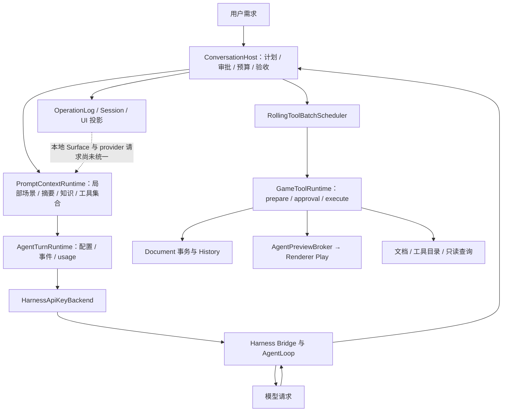
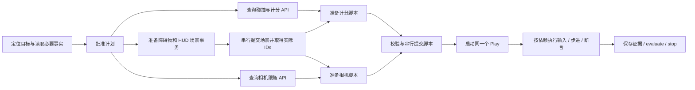

# AIStudio Agent 效率分析与优化方案

日期：2026-09-16。分析基线：`babcb28` 加当前工作区已有修改。

本次交付为代码审计、局部实验和实施方案，不修改 Agent 运行逻辑，不推进 milestone 状态。工作区已有材质、渲染等修改按现状分析，不属于本次改动。

## 1. 结论与优先顺序

AIStudio 已经具备比较完整的工具治理和恢复底座：注册表分类、DAG/rolling scheduler、Document 事务、审批、预算、证据验收、持久会话、场景增量、按需工具和有来源检索。下一步应把这些能力接到真实模型请求链路，并减少层间重复工作。

建议顺序：

1. **P0：修正模型请求与上下文的真实边界，打通 Harness 只读并发。** 本地 Surface 压缩不能代表实际 provider 历史缩短；并发数与上游安全分类都要接通。
2. **P1：减少模型往返。** 消除机械查文档/查 revision，稳定工具集合，合并独立读取、编辑提交和验证步骤，压缩重复提示词与无关结果。
3. **P1：减少宿主等待。** 合并流式投影写入、预览命令优先处理、知识索引增量刷新、scheduler 事件唤醒。
4. **P2：增加任务级依赖图与有限并行规划。** 先用单 Agent 规划 + 现有 scheduler；只有重任务独立、合并收益明确时才考虑多 Agent。

重要区分：工具执行并发降低工具等待时间；把多个调用放入同一个模型 step 才能减少模型请求轮数。二者分别计量，不能互相代替。

## 2. 当前实现地图

| 方面 | 已有实现 | 当前有效范围与缺口 |
| --- | --- | --- |
| 后端隔离 | 仅 harness-bridge 引入 Harness/Cordis，固定 `0.1.5-rc.2` | 保留边界，不需要为了本轮优化升级上游 |
| 工具调度 | 注册表推导 effect；默认并发 4；完整 DAG 和流式队列 | Harness 默认独占，很多并发能力停留在下游 |
| 编辑事务 | 精确 baseRevision、低风险相邻编辑成组、提交串行、幂等回执 | 必须先让同轮调用同时到达 Host，事务成组才能充分发挥作用 |
| 计划 | plan.propose、plan.update、审批、固定验收标准 | items 只有文本/进度，没有任务依赖、输入/产物、读写集 |
| 上下文 | CAS、局部 query/diff、reference-only、结构化任务摘要 | 内容有重复；工具集合变化会中断同会话复用；本地与 provider 历史不同源 |
| 压缩 | 压力阈值、不可变 Surface、两阶段发布、pin facts | 产品路径主要手动压缩，未成为每次真实模型请求的强制准备过程 |
| 工具发现 | `tool.search`、`studio.tool.invoke`、按任务选择 schemas | 当前实际为 12 core + 8 扩展；续跑通用指令污染选工具 |
| 检索 | 关键词、local hash embedding、图关系、权限/版本过滤 | 不是训练式语义 embedding；刷新在启动关键路径；精确事实不能被检索替代 |
| 等待/恢复 | 用户 barrier 持久化并释放 provider；恢复 claim/epoch | 已避免长期挂起 provider，不应删掉这套机制来“提速” |
| 验证/修复 | scoped inspect、gesture、evaluate；重复 repair 指纹 | 应复用，扩展到一般重复查询/失败；不能削弱验收换取更少调用 |
| 可观测性 | turn usage、工具 bytes、节点 latency、事务锁指标 | 缺 request/step 级真实上下文、模型轮数及完整关键路径分解 |

源入口：`packages/agent-orchestration/src/conversation-host.ts`、`packages/agent-runtime/src/index.ts`、`packages/harness-bridge/src/harness-agent.ts`、`packages/game-authoring-tools/src/scheduler/`。

## 3. 已确认的问题和证据

### F1. Harness 的两道串行限制，P0

`harness-agent.ts`：

- `ToolRuntime` 配置 `maxParallelSubCalls: 1`，`AgentLoop` 配置 `maxParallelToolCalls: 1`。
- `sessionCapabilities()` 返回 `parallelToolCalls: false`。
- `toolDefinition()` 没有提供 `isConcurrencySafe`。
- 本地固定版本 `dsh-tools` 的 `executionMode()` 明确将未声明 `isConcurrencySafe` 的工具视为 exclusive。因此 native 路径只改 `maxParallelToolCalls` 仍不会并发。

本次 mock-provider 实验：同一模型响应返回两个独立 `scene.query`，每个宿主结果延迟 100ms。两个 tool-request 在约 73ms、176ms 到达；首次释放结果前只收到一个请求。实验发生 2 次模型请求（工具调用响应 + 最终答复），没有调用真实 API。

此外，桥接事件没有 step/batch 边界，也没有传输 `dependsOn`、`outputProjection`。Host 虽可读取这些字段，当前 Harness 映射并未提供。自然语言要求“声明依赖”不能替代可用协议。

### F2. 本地 ContextFrame / 压缩没有约束实际请求，P0

调用链证据：

- `AgentTurnRuntime.start()` 验证 artifacts 后直接调用 `backend.startTurn()`。
- Host 在消费后端事件时，经 `ensureSessionTurnStarted()` 调用 `captureSessionContextFrame()`；此时 provider turn 已启动。
- 默认 `ModelContextRuntime.frames` 没有绑定 compactor；自动压缩需要显式使用 `createPipeline()`。
- Host 捕获 ContextFrame 时没有提供实际 envelope、工具 schema 的 `inputs/additionalInputTokens`，也没有传入最近 provider usage；捕获失败只记 warning。
- 手动压缩修改本地 Surface；Harness `compactSession()` 返回 unavailable，`start()` 仍用 `agent.followup()` 追加当前 prompt。
- `PromptContextRuntime.prepare()` 读取自己的 task-summary 索引，未读取压缩后 Surface 作为 provider 消息源。

因此目前不能用 UI 压力或本地 Surface 变小来证明实际请求 token 下降；也不能认为 92% 的本地 emergency 检查已经在产品链路上拦住每个模型请求。还需覆盖 Harness 一个 turn 内的多次模型 step。

### F3. 工具集合漂移导致续跑失去会话复用，P1

`continueTask()` 将完整 `approvedPlanRequest()` 等通用指导交给 `modelTools(request)`。`ToolCatalogRuntime.selectDefinitions()` 会优先提取其中显式工具名，再做意图/语义排序。通用说明中的 assembly、Play、实体创建工具会占用扩展名额。

`PromptContextRuntime.prepare()` 仅在完整 tool signature 一致时复用 provider session。三个本地合成计划样例的初始请求与批准后请求，工具集合全部发生变化；“呼吸动画”示例还丢失了初始入选的 `script.propose`。这是可复现的选择器现象，不是生产成功率统计。

当前已有 `studio.tool.invoke` 能按精确工具版本执行省略的 schema，因此没必要在每个阶段重新选择全部 native tools。

### F4. 有可直接移除的重复上下文，P1

`PromptContextRuntime.prepare()` 存储 policy 时同时放入 `profile` 和 `stablePrefix()`；`profile.modules[].content` 已含完整正文，`stablePrefix()` 再次包含同一正文。

本次以当前代码测得：该 JSON 投影 9,215 bytes；保留 profile 的 id/version/digest 并只保留一份正文为 4,374 bytes，减少 **52.5% 的 policy 投影字节**。这不是整体请求或真实 token 的降幅。完整审计 profile 仍应留在 CAS。

补充测量：58 个注册工具；12 个 core；默认选择 20 个定义；3 个初始样例所选 schema 为 29,339–33,731 bytes，全目录为 70,887 bytes。Host 还追加两个计划工具和 invoke；plan.propose 定义本身约 6,129 bytes。现有架构文档中的“10 core / 18 工具”已落后于源码，应同步。

### F5. Prompt 强制步骤增加机械调用，P1

`GENERAL_GAME_AUTHORING_MODULES` 要求规划前 `engine.docs.search`、每次编辑前重读 revision。Host 还为 project.snapshot 加了“规划前读取”描述。

即使 envelope 已含当前 revision，或上一条 mutation 结果已返回提交后的 revision，模型仍可能重复 snapshot；简单改色也会受到通用文档、assembly、测试长指令影响。这是提示策略带来的潜在额外调用，生产发生率需以 trace 统计。

`plan.update` 已允许批量进度更新，但 Host 每累计六次工具会附加进度同步提示；它没有执行依赖图，可能增加进度汇报轮次。应让语义阶段与工具结果绑定，继续区分“进度完成”和“验收通过”。

### F6. 结果压缩有接口，但默认全量且摘要不够可操作，P1

`normalizeToolBatchRequest()` 默认 `outputProjection: full`；Harness 不携带该字段。Host 的 `projectToolModelResult()` 摘要主要保留 keys/digest/bytes，不能普遍保留下一步必需的 entityId、revision、proposalId、nextCursor 等。

直接切成 digest-only 会让模型丢信息并追加读取。应该按工具输出可执行的摘要，把正文留在 CAS；错误的修复信息和 gesture 诊断已做保留，可继续复用。

### F7. 持久化与 UI 刷新放大流式事件开销，P1

- `AgentTurnRuntime.consume()` 对每个 backend event 等待一次日志 append，包括文本 delta。
- Host 对每个事件调用 `updateTaskRun()`，即使 sessionId/turnId 未变化，也生成新 revision、写任务投影。
- `project()` 每次更新都走 `persistProjection()`；项目会话还写 execution-data、execution-record。
- `OperationLog` 默认 `flushPolicy: always`，单条 journal append 有 open/write/sync/close；项目历史同样显式使用 always。

这证明有写放大路径。具体 fsync 毫秒数和整体占比尚未测量，不声称它已经是最大瓶颈。UI 的 50ms 通知合并并不会合并这些持久写入。

### F8. 部分等待可以消除，但已有 push 不应误判为固定轮询，P1/P2

- `RollingToolBatchScheduler.drain()` 使用 `while + setTimeout(0)` 等待状态，应改为 completion promise。
- Renderer 已采用 push + single-flight，30 秒只是兜底间隔，不能解释为每个工具固定等 30 秒。
- `pollAgent()` 先拉 conversation/replay，再可能刷新编辑器，再处理 Preview command。`refreshConversation()` 把所有首次看到的成功 tool-result 都标记为 editorChanged，包括只读结果。
- `prepareKnowledge()` 每次启动/续跑都被 await，超时上限默认 1.5 秒；是最长可阻塞时间，不是固定耗时。Loader 每次会构造全项目元数据后 upsert，内置文档已由 builtinsReady 去重。

### F9. 摘要还不是持续更新的任务记忆，P1/P2

task summary 按 goals/decisions/toolFacts/acceptance/blockers 五组追加字符串、去重、各留 12 条；revision 变化会清掉全部 revision-bound toolFacts/acceptance。对大项目中不相关编辑，失效范围过粗。

手动压缩的本地 fallback 将对话串起来再从头截断到预算，不按任务相关性选择消息。压缩器另有 pinned facts 保护，不能说必然丢失所有关键事实，但未 pin 的较新决定可能被旧内容挤掉。

## 4. 目标架构：只保留一套执行与上下文真值

### 4.1 每个真实模型请求都通过 Request Preparation

扩展现有 runtime 与 bridge seam，不新建根生命周期、工具注册表或 Document 写入路径。

请求准备的输入：logical session、provider binding、request/step id、模型配置、固定工具集合、当前 Surface generation、最新 revision、有效事实、预算。

请求准备的输出：实际发送的 messages/tools 或对应不可变 manifest、token 估计与组件分项、provider history epoch、digest、可发送/需压缩/需重绑状态。

要求：

1. 检查在请求发送前生效；同一 Harness turn 内下一次模型 step 也经过它。
2. 统计实际 messages、system policy、tool schemas、工具结果及协议开销；不能只估本地聊天正文。
3. 最近一次 provider usage 用于校准估计；账单累计 input tokens 与当前上下文窗口大小必须分开。
4. 80% 自动压缩、92% 阻止继续请求沿用现有策略，但在真实请求入口执行。无容量信息时显示 unknown；先获取显式模型容量，不伪造阈值。
5. 先验证固定版本 upstream 的 request hook 是否允许安全准备/替换消息；若不能，在安全 step 边界结束并重绑 provider 会话，用本地结构化恢复包继续。不要依赖 monkey patch。
6. 压缩后的 Surface 必须成为实际重新发送的内容。Harness 不支持原生压缩时，新建 provider session，重放保留事实、必要工具配对和任务状态；logical task/session 保持连续。
7. 只有发送/恢复确认成功后才切换 history epoch 和 sent-artifact 基线。失败时保留旧会话/Surface；新 epoch 中不能继续 reference-only 指向已丢弃内容。

新增/扩展共享字段统一由 studio-contracts 拥有；不把上游类型传给 orchestration。

### 4.2 上下文分层与预算

| 层 | 模型收到什么 | 何时更新 |
| --- | --- | --- |
| 稳定前缀 | 一份精简 policy、工具协议、稳定 core schemas | profile 或工具版本变化 |
| 任务状态 | 原始目标、已批准范围、未完成节点、约束、验收和 blocker 状态 | 阶段/决策发生变化 |
| 精确工作集 | 目标实体、相关组件/脚本、依赖、revision 和已知缺口 | 查询范围或相关事实失效 |
| 当前执行结果 | 必需 IDs、提交 revision、diff 摘要、失败字段、下一步引用 | 每批工具完成 |
| 可选知识 | 与当前节点相关且未发送的文档片段，带简短来源 | 能力缺失或知识版本变化 |
| 当前需求/增量 | 用户最新补充、当前明确要解决的问题 | 每次用户输入/继续执行 |

具体改动：

- policy artifact 只发送一份正文；完整 profile/module digests 留审计 manifest，不在模型正文重复。
- 工具 schema 已经 native 发送时，capability manifest 只保留紧凑 IDs/必要能力索引，不再重复长 descriptions。
- 工具选择使用原始用户目标 + 当前节点所需能力；禁止使用整段通用 continuation 指令作为主要检索 query。
- 同一 task 固定 native allowlist，省略工具经 invoke 精确调用；切新 task 再评估，变更模型或工具合同则显式重绑。
- 对知识命中使用 source+version+contentDigest+range 去重；在当前 provider epoch 确认已保留后才发 reference-only。
- Task memory 由字符串列表逐步升级为有 factId、scope、sourceRef、revision/dependencies、status 的记录。局部事实按依赖失效；全局验收仍按原严格 revision 规则，不能随便跨版本复用证据。
- 已解决 blocker 替换其状态，不与旧 blocker 一起无限追加；保留最近失败假设和已排除方案，防止重复探索。
- 优先复用可从事件恢复的结构化摘要；只有自由文本确需理解且节省大于成本时才调用模型总结。原文和来源留 CAS。
- token 分配按当前任务和模型窗口计算，96KiB 仅保留为传输保护。先保留原始需求、批准范围、精确事实/错误，再裁剪可选知识和历史。

工具结果建议最小包（按工具定义裁剪）：`status / identity / baseRevision / afterRevision / changedIds / diagnostics / evidenceRefs / nextCursor / artifactRef`。script.get 等任务需要的源码仍按需原文提供，不用摘要代替待修改代码。

### 4.3 减少不必要工具调用

1. 把“每次编辑前重新查询”改成“使用最近一次已确认的 revision；外部编辑、目标范围变化、缺少必要事实或 stale-revision 拒绝后才重查”。提交时的精确 revision 校验不变，不自动 rebase。
2. 把“规划前总查文档”改成“能力/签名未知时查询”。已有精确 schema 和同版本文档时直接使用；简单属性编辑不强制启动通用研究流程。
3. 只读去重 key 包含 project/document、权限、工具版本、规范参数、scope/projection、revision 或 runtime tick、内容版本。缺版本的动态读取不缓存；并发相同请求可共享执行，但每个 call 保留独立结果/计费记录。
4. 多实体属性修改优先现有 get-many、transform batch、assembly/prefab 和事务；不以 N 次重复 primitive 创建代替复合对象合同。
5. 工具失败返回精确字段、合法值/引用和恢复步骤；版本确定时直接附小段正确 schema，不一律要求模型再 tool.search。
6. 已有 play.pointer-gesture / play.regression 复用其有界动作链。进一步需要组合验证时，由原工具 runtime 执行已声明的确定性步骤；避免每个 input/step/inspect 都让模型重新决策。遇到诊断分支再交回模型。
7. 保留现有失败指纹和 repair budget，将“同参数 + 同状态 + 同错误”无变化重复检测扩展到普通工具；outcome-unknown 始终 reconcile，不能直接重试 mutation。
8. plan.update 合并阶段转换；已知工具节点绑定 plan item 后可自动记录运行/阻塞状态，语义完成与最终验收仍由明确证据决定。

现有产品要求每次 mutation 前计划批准。第一轮优化保留此规则；“低风险小编辑免单独计划批准”属于可选产品策略变更，不能在性能改造中隐式放开。

## 5. 判断任务能否并行

### 5.1 三种并行分开处理

| 层次 | 适合对象 | 实施方式 |
| --- | --- | --- |
| 工具级 | 已知参数的独立读取 | 一次模型 step 发多个调用，现有 scheduler 并发 |
| 工作流级 | 文档检索与准备场景；独立脚本方案/校验 | 计划节点 DAG，共享只读快照，准备可重叠，提交走原串行事务 |
| 多 Agent | 大型且产物可独立合并的研究、脚本方案、测试设计 | 后续可选；隔离上下文与预算，只回传结构化产物/证据 |

多个 plan item 标记为 in_progress 只表达进度，当前不等于实际并行任务执行。

### 5.2 计划节点最小信息

扩展现有合同/plan，而非另建任务系统：节点包含 `id`、目标、`dependsOn`、已知输入引用、预期产物、读取范围、写入范围、验证方式、预算和预计工作量。

模型建议依赖和范围；宿主用注册表、校验后的参数、实际引用及资源关系确认。模型声明的 read/write/effect 不作为授权或并发安全依据。未知依赖默认串行。

两节点可并行的必要条件：

- 不存在结果依赖，参数已知；需要前一步返回的对象 ID、proposalId、文档引用时等待该结果。
- 同一快照下只读，或命中审计过的固定文档/注册表读取白名单。
- 没有相冲突的写入；父子变换、共享材质/资源、全局相机/设置、组件关联也计入影响范围，不能只比较 entityId。
- 没有 plan/approval/trusted-code/runtime 完整屏障。
- 并发符合剩余 token/时间/调用数预算，结果可确定性归并，取消可排空。

预计收益采用：`串行关键路径 - 并行关键路径 - 规划/调度/合并开销`。收益不明确或小于测得的拆解成本时，保持直接执行。简单改色不新增一次模型规划请求；复杂任务的分解随原计划一起产生。

### 5.3 Harness 落地路线

**阶段 A：只读并发。** 由 Studio 注册表生成 provider-neutral 可信并发提示，bridge 映射为 upstream `isConcurrencySafe`，AgentLoop 并发上限先为 4。unknown、计划/审批、Play、脚本和 mutation 仍独占。`studio.tool.invoke` 必须解析当前真实目标后分类，不能把整个通用入口标成安全。

**阶段 B：完整同轮 batch。** 为桥接层增加明确的 step/batch id 与 batch-close 语义，防止仅按相邻流事件猜批次。若 upstream exclusive 分组仍阻止多个编辑到达 Host，可增加窄的结构化 batch 传输入口：Host 先展开成员，再进入原 normalize/prepare/scheduler/transaction 路径。每个子调用独立校验、预算、审批、日志和结果，外层不能又占据相同执行屏障而死锁。

第一版不支持任意代码，也不允许在批内猜测尚未生成的 IDs。需要结果绑定时，另行版本化明确的引用/类型校验合同；未完成该合同前分成下一批。

Document mutation 始终串行提交；多个不同实体也可能共享全局 revision。并行的是读取、准备和独立工作，不是绕过事务并发写场景。维护目前 call-order result commit；其队头等待先测量，不能为乱序交付破坏 provider 协议。

### 5.4 具体示例

需求：“添加障碍物、积分 HUD 和相机跟随，并验证碰撞计分。”

图中两个脚本的准备可作为未来工作流并行节点；当前注册的 trusted-code 工具仍有完整屏障，不能直接 Promise.all(script.propose/apply)。同一 Play 的 input/step/capture 有共享状态，继续有序执行。

多 Agent 仅在阶段 A/B 已测得收益、任务体量足够后启用。父 Agent 持有写入/审批权；子任务拿最小事实包，返回候选 patch/方案/测试和来源，不共享一整份历史、不直接修改同一 Document。资源不足或输出高度耦合时不用多 Agent。

## 6. 减少宿主和流程等待

| 改造 | 建议 | 必须保持 |
| --- | --- | --- |
| 文本持久化 | 文本 delta 在内存流式展示，按时间/字节阈值聚合落盘；工具边界、终态强制 flush | 原始顺序、可恢复 checkpoint；明确崩溃最多丢失的非关键流式尾部 |
| TaskRun 投影 | patch 没有有效变化则跳过；短窗口只写最新投影 | 审批、预算、事务、验收的 durable facts 不能去重丢失 |
| journal 写入 | 先减少无意义事件；必要时现有日志内 group commit、复用文件句柄 | 关键 append 的 promise 仅在 durability 满足后 resolve；不全局改 manual flush |
| Preview 交接 | 独立 typed push/commandId/ack 通道优先处理，聊天 replay 不挡住 runtime 命令 | renderer 所有权、取消、迟到结果隔离、生命周期 |
| 编辑器刷新 | 根据 committed revision/changedIds 决定，文档/诊断只读不刷新整场景 | 人工编辑与 Agent 结果一致，revision fence 不弱化 |
| drain 等待 | 记录每个 entry completion promise 或统一 idle waiter，用完成/取消事件唤醒 | 活跃操作真正退出后才能 dispose，不能只取消等待者 |
| 知识索引 | 项目/文档变更时增量刷新；当前 revision 已索引则跳过；复用在途 refresh | 旧版本索引不能冒充当前事实，失败回退 exact context |
| 启动准备 | 可独立的 exact query、静态工具准备和可选检索并行；启动即显示进度 | 捕获一致 revision，不能混合不同项目快照 |
| 失败等待 | 区分 provider 429/网络退避、人工等待、工具 timeout、锁等待 | 不删除合理退避；展示 retry-at、支持取消；不重试不确定 mutation |

## 7. 实施工作包

W1 实施记录见 [agent-efficiency-w1.md](./agent-efficiency-w1.md)。下文的初始基线与评测目标保留为分析时记录，实际实施和验证结果以该记录为准。

W2 只读并发实施记录见 [agent-efficiency-w2.md](./agent-efficiency-w2.md)。

W5 等待与持久化实施记录见 [agent-efficiency-w5.md](./agent-efficiency-w5.md)。

W6 计划 DAG 与完整批次实施记录见 [agent-efficiency-w6.md](./agent-efficiency-w6.md)。

| 包 | 优先级 / 规模 | 修改落点 | 验收条件 |
| --- | --- | --- | --- |
| W0 基线 | P0 / 小 | bridge request instrumentation；runtime usage；现有 evals | 精确区分 turn 与 model request，分项记录 TTFT、工具/审批/持久化等待、上下文字节/token |
| W1 去重复 | P1 / 小 | prompt-context、plan-policy、catalog、tool-correction | policy 正文只出现一次；简单编辑不强制搜索；同任务工具签名稳定；正确字段反馈减少补查 |
| W2 接通只读并发 | P0 / 中 | contracts、bridge、backends、scheduler 接线 | mock 同响应两独立工具在任何结果释放前均到达 Host；maxConcurrency 为 2–4；mutations/barriers 无越界 |
| W3 请求上下文统一 | P0 / 大 | runtime context/compaction/backends、bridge hook、Host | 首次请求及 turn 内后续 step 均预检；压缩后实际请求缩小；新 epoch 不引用丢失上下文；失败保持旧真值 |
| W4 工作集/结果 | P1 / 中 | prompt-context、router、catalog、结果 projection | 下一步必要 IDs/revision 不缺失；作用域正确去重；不增加补读；原始证据可回溯 |
| W5 等待/写入 | P1 / 中 | conversation-host、operation-log、renderer、preview broker、rolling | 相同 TaskRun 不落盘；流式事件写入显著下降；只读不刷新场景；预览不被聊天 replay 阻挡 |
| W6 计划 DAG / batch | P2 / 大 | 共享 plan/task 合同、orchestration、现有 scheduler | 可解释并行/串行原因；数据依赖、屏障、超时、失败传播、事务恢复全覆盖 |
| W7 可选多 Agent | P2 / 后置 | provider-neutral 子任务端口、共享预算、产物合并 | 只在大任务 A/B 中取得净收益；小任务零额外模型请求；无重复写入 |

推荐合并次序：W0 → W1 → W2 → W3 → W4/W5 → W6；W7 依据 W6 的真实收益再决定。规模表示相对复杂度，不是交付日期估计。

各包单独 feature flag，可回退到现有串行/完整上下文路径；回退不能改变已提交事务或已经生效的用户授权。继续使用既有 root effect tree。

## 8. 评测与验收

本次已完成：相关依赖与 orchestration/bridge 构建；Harness 升级兼容、prompt context、compaction、tool batch scheduler、tool catalog 五组定向测试，**61/61 通过**。未运行真实付费模型，也未运行完整 npm run check；本次仅新增分析文档和测量记录。

现有 `measure-m13-g06-batch.mjs`：3 个各等待约 90ms 的模拟读取，从 273ms 降到 94ms，观测并发 3。脚本的 modelCalls=3/1 是预设标签，没有发起模型请求，不能当作真实 DeepSeek 轮次或端到端提速证据。

后续实验矩阵至少包括：简单属性改动、局部动画、跨实体交互修复、重复组合对象、大场景局部编辑、长对话续跑、审批后恢复、用户同时编辑、取消/崩溃恢复。覆盖冷/热会话及不同工具集合。

使用相同模型/推理配置、项目快照、需求和验收；先进行 deterministic mocked tests，再对真实模型每种场景至少 5 次配对试跑，初步看 median/p95 与成功率。小样本只做筛查，方差大或成功率边界不明时增加样本再默认开启。

| 指标 | 建议目标（待基线确认，不是已实现收益） |
| --- | --- |
| 用户验收 | 必需条件不降低；事务/审批/恢复错误不得增加 |
| 简单任务额外规划 | 不新增独立模型规划轮次；保留当前授权要求 |
| 真实模型请求数 | 在可批处理任务中降低 20%–35% |
| 总 input tokens | 同等成功率与相同任务下降低 20%–35%，单独报告 cached/uncached |
| 重复只读调用 | 同版本、同参数、同范围、已知有效的重复读取降低至少 70% |
| 工具并发 | 适用的只读批次实测并发 2–4，报告 parallelizable/actual 比例 |
| 主动执行耗时 | 可并行任务 median 降低约 20%；p95 不因排队/恢复退化 |
| 冗余持久化 | 流式场景事件/投影写入减少至少 80%；关键事实 durability 不变 |
| 上下文压缩真实性 | provider 发送内容和 token 估计实际下降，而非仅本地 UI ratio 下降 |

测量 `T_total` 时分开标注人工等待、provider 请求、工具 body、排队/锁、结果提交、持久化和 UI/preview handoff。并发区间用 trace 关键路径计算，不直接把各 span 相加。费用与 token 不只看平均值：每次压缩/子 Agent 的额外开销都计入同一 task。

首批关键回归：

- Harness 两个只读并发、一个 mutation 后两个场景读取、固定文档与写入、invoke 目标分类、未知工具独占。
- step/batch 边界中穿插 text/usage，结果顺序不乱，不等不存在的 forward dependency。
- 不同 entity 的同 revision 写入、父子/共享资源冲突、部分失败、取消后 late result。
- 压缩后捕获实际请求；新 session 的已丢弃 artifact 必须重新展开；用户最新要求/批准范围/未完成调用不丢失。
- scene revision 改变时查询缓存失效；reference-only 仅针对当前 provider epoch；动态 Play 读取不跨 tick 缓存。
- 简单改色、动画、拖拽修复三例的 continuation 不被通用提示污染工具选择。
- streaming 持久化合并后，重启仍保留审批、预算、receipt、evidence，事务最多提交一次。

完整改造的每个工作包执行相关定向测试，再跑仓库 `npm run check` 和对应 milestone 门禁；不以局部 benchmark 代替整条产品链验证。

## 9. 第一轮建议范围

第一轮优先交付 W0/W1/W2，并完成 W3 的真实请求边界验证。这样可以先解决已证明的 policy 重复、工具集合漂移和 Harness 串行限制，同时防止“本地压缩看起来成功、实际请求仍膨胀”。后续再做 DAG、多 Agent，避免先增加规划层和上下文复制成本。

局部实验记录见 [agent-efficiency-baseline-2026-09-16.json](../evidence/agent-efficiency-baseline-2026-09-16.json)。以上比例目标均需真实任务评测，不能当作已交付性能承诺。

W3 实现和验证说明见 [agent-efficiency-w3.md](./agent-efficiency-w3.md)。真实请求边界使用公开 Harness hooks 与 Surface replacement，新增 provider epoch 确认及失败回滚。

W4 实现与验证说明见 [agent-efficiency-w4.md](./agent-efficiency-w4.md)：确认后的精确工作集复用、按 provenance 去重知识、native schema 去重及工具结果字段保全。

W7 实现与启用门槛见 [W7：按需启用的隔离子任务](./agent-efficiency-w7.md)。默认关闭，真实模型 A/B 收益尚未验证。
